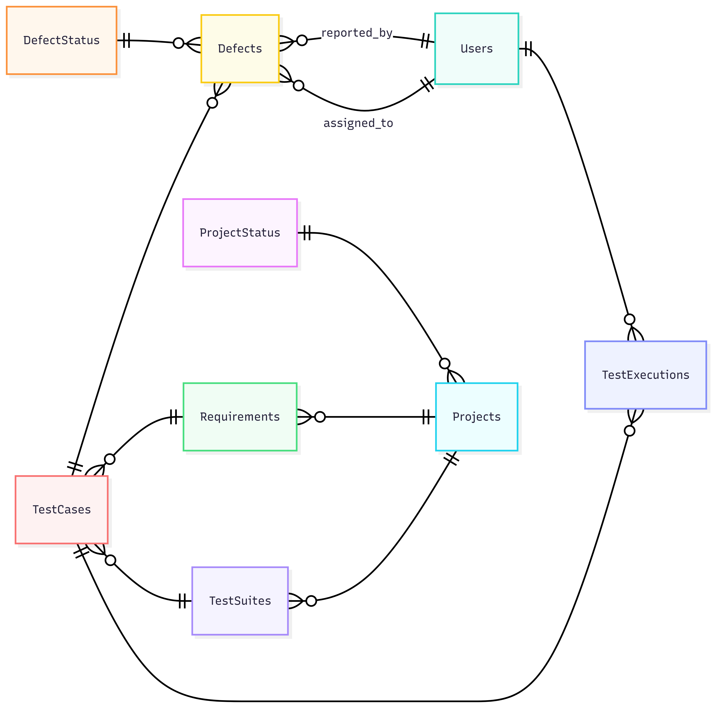

# Design Document

By Rosangela Lima

Video overview: (Normally there would be a URL here, but not for this sample assignment!)

## Scope

The database for the Test Case Management System includes the main entities necessary to support the software testing process during a project's lifecycle. The database scope includes:

* Projects, including basic information such as name, description, and status
* Requirements, which define the features and business rules that need to be tested. Requirements are usually specific to each project and are not reused between different projects.
* Test Suites, used to organize related Test Cases within a project
* Test Cases, including test steps, priority, and the requirements they validate
* Test Executions, including execution date, tester, execution status (Pass/Fail/Blocked), and execution notes
* Defects, including title, description, severity, priority, status, and the Test Case related to the issue

Out of scope are features such as automated test execution, file attachments, integration with external tools (e.g., Jira or GitHub), notifications, dashboards, and user authentication.

## Functional Requirements

This database will support:

* CRUD operations for Projects
* CRUD operations for Requirements
* CRUD operations for Test Suites
* CRUD operations for Test Cases
* Associating Requirements with Test Cases
* Organizing Test Cases into Test Suites
* Executing Test Cases
* Recording test execution results
* Creating, viewing, and updating Defects related to failed Test Cases
* Viewing project metrics and testing information

Note that, in this iteration, the system will not support automated testing, user authentication, notifications, file attachments, or integration with external tools.

## Representation

Entities are captured in SQLite tables with the following schema.

### Entities

The database includes the following entities:

#### Project Status

The `project_status` table includes:

* `id`, which specifies the unique ID for the project status as an `INTEGER`. This column thus has the `PRIMARY KEY` constraint applied.
* `name`, which specifies the status name as `TEXT`. A `UNIQUE` constraint ensures that each status has a unique name.

This table stores the possible statuses that a project can have during its lifecycle.

#### Users

The `users` table includes:

* `id`, which specifies the unique ID for the user as an `INTEGER`. This column thus has the `PRIMARY KEY` constraint applied.
* `name`, which specifies the user's name as `TEXT`.
* `role`, which specifies the user's role in the system as `TEXT`. A `CHECK` constraint ensures that only valid roles can be stored.

The users table represents the people responsible for managing projects, executing tests, and resolving defects.

#### Defect Status

The `defect_status` table includes:

* `id`, which specifies the unique ID for the defect status as an `INTEGER`. This column thus has the `PRIMARY KEY` constraint applied.
* `name`, which specifies the defect status name as `TEXT`. A `UNIQUE` constraint ensures that each defect status has a unique name.

This table stores the possible statuses that a defect can have during its lifecycle.

#### Projects

The `projects` table includes:

* `id`, which specifies the unique ID for the project as an `INTEGER`. This column thus has the `PRIMARY KEY` constraint applied.
* `name`, which specifies the project name as `TEXT`. A `UNIQUE` constraint ensures that two projects cannot have the same name.
* `description`, which specifies additional information about the project as `TEXT`.
* `status_id`, which specifies the current project status as an `INTEGER`. This column has the `FOREIGN KEY` constraint applied, referencing the `id` column in the `project_status` table.

The projects table stores the main information about each project managed by the system.

#### Requirements

The `requirements` table includes:

* `id`, which specifies the unique ID for the requirement as an `INTEGER`. This column thus has the `PRIMARY KEY` constraint applied.
* `project_id`, which specifies the project related to the requirement as an `INTEGER`. This column has the `FOREIGN KEY` constraint applied, referencing the `id` column in the `projects` table.
* `code`, which specifies the requirement code as `TEXT`. A `UNIQUE` constraint combined with `project_id` ensures that each requirement code is unique within a project.
* `title`, which specifies the requirement title as `TEXT`.
* `description`, which specifies additional information about the requirement as `TEXT`.

The requirements table stores the features and business rules that need to be tested for each project.

#### Test Suites

The `test_suites` table includes:

* `id`, which specifies the unique ID for the test suite as an `INTEGER`. This column thus has the `PRIMARY KEY` constraint applied.
* `project_id`, which specifies the project related to the test suite as an `INTEGER`. This column has the `FOREIGN KEY` constraint applied, referencing the `id` column in the `projects` table.
* `name`, which specifies the test suite name as `TEXT`.
* `description`, which specifies additional information about the test suite as `TEXT`.

The test_suites table is used to organize related test cases within a project.

#### Test Cases

The `test_cases` table includes:

* `id`, which specifies the unique ID for the test case as `INTEGER`. This column thus has the `PRIMARY KEY` constraint applied.
* `test_suite_id`, which specifies the test suite related to the test case as `INTEGER`. This column has the `FOREIGN KEY` constraint applied, referencing the `id` column in the `test_suites` table.
* `requirement_id`, which specifies the requirement validated by the test case as `INTEGER`. This column has the `FOREIGN KEY` constraint applied, referencing the `id` column in the `requirements` table.
* `title`, which specifies the test case title as `TEXT`.
* `steps`, which specifies the steps required to execute the test case as `TEXT`.
* `priority`, which specifies the importance level of the test case `TEXT`. A `CHECK` constraint ensures that only valid priority values can be stored.

The test_cases table stores the test scenarios used to validate system requirements.

#### Defects

The `defects` table includes:

* `id`, which specifies the unique ID for the defect as `INTEGER`. This column thus has the `PRIMARY KEY` constraint applied.
* `test_case_id`, which specifies the test case that identified the defect as an `INTEGER`. This column has the `FOREIGN KEY` constraint applied, referencing the `id` column in the `test_cases` table.
* `title`, which specifies the defect title as `TEXT`.
* `description`, which specifies details about the defect as `TEXT`.
* `reported_by`, which specifies the user who reported the defect as `INTEGER`. This column has the `FOREIGN KEY` constraint applied, referencing the `id` column in the `users` table.
* `assigned_to`, which specifies the user responsible for fixing the defect as an `INTEGER`. This column has the `FOREIGN KEY` constraint applied, referencing the `id` column in the `users` table.
* `severity`, which specifies the impact level of the defect as `TEXT`. A `CHECK` constraint ensures that only valid severity values can be stored.
* `priority`, which specifies the importance level of the defect as `TEXT`. A `CHECK` constraint ensures that only valid priority values can be stored.
* `status_id`, which specifies the current defect status as an `INTEGER`. This column has the `FOREIGN KEY` constraint applied, referencing the `id` column in the `defect_status` table.
* `created_at`, which specifies when the defect was created as `TEXT`. The default value is the current timestamp.

* `updated_at`, which specifies the last update time of the defect as `TEXT`. Its initial value defaults to the current timestamp and is automatically updated whenever the defect is modified.

The defects table stores problems identified during test execution.

#### Test Executions

The `test_executions` table includes:

* `id`, which specifies the unique ID for the test execution as an `INTEGER`. This column thus has the `PRIMARY KEY` constraint applied.
* `test_case_id`, which specifies the executed test case as an `INTEGER`. This column has the `FOREIGN KEY` constraint applied, referencing the `id` column in the `test_cases` table.
* `executed_by`, which specifies the user who executed the test as an `INTEGER`. This column has the `FOREIGN KEY` constraint applied, referencing the `id` column in the `users` table.
* `execution_date`, which specifies when the test execution occurred as `TEXT`. The default value is the current timestamp.
* `notes`, which specifies additional information about the execution as `TEXT`.
* `status`, which specifies the execution result as `TEXT`. A `CHECK` constraint ensures that only valid execution results can be stored.

The test_executions table stores the history of test case executions, allowing multiple executions for the same test case.

### Relationships

The entity relationship diagram below describes the relationships among the entities in the database.

As detailed by the diagram:

* One project can have 0 to many requirements. 0, if the project does not have any requirements registered yet, and many if the project contains several features or business rules that need to be tested. Each requirement belongs to one and only one project. Requirements are not shared between different projects.
* One project can have 0 to many test suites. 0, if no test suites have been created yet, and many if the project contains different groups of test cases. Each test suite belongs to one and only one project.
* One requirement can have 0 to many test cases. 0, if no test case has been created to validate the requirement yet, and many if the requirement requires multiple test scenarios. Each test case is associated with one and only one requirement.
* One test suite can contain 0 to many test cases. 0, if no test cases have been added yet, and many if the test suite contains multiple tests. Each test case belongs to one and only one test suite.
* One test case can have 0 to many defects. 0, if no problems are found during execution, and many if different issues are identified while testing the same functionality. Each defect is associated with one and only one test case.
* One defect has one and only one status. At the same time, one defect status can be associated with 0 to many defects. For example, a status can have no defects or can be used by many defects during the testing process.
* One user can report 0 to many defects. 0, if the user has not reported any defects yet, and many if the user reports multiple issues. Each defect is reported by one and only one user.
* One user can be assigned to 0 to many defects. 0, if the user does not have any defects assigned, and many if the user is responsible for resolving multiple defects. A defect can have 0 or 1 assigned user because it may not have been assigned yet.
* One test case can have 0 to many executions. 0, if the test case has not been executed yet, and many if the test case is executed multiple times during the project lifecycle. Each test execution is related to one and only one test case.
* One user can perform 0 to many test executions. 0, if the user has not executed any tests yet, and many if the user performs multiple test executions. Each test execution is performed by one and only one user.

## Optimization

According to the queries defined in `queries.sql`, users frequently need to access requirements and test suites from a specific project. Therefore, indexes were created on the `project_id` columns in the `requirements` and `test_suites` tables to improve these searches.

Users also need to find test cases related to a specific test suite or requirement. For this reason, indexes were created on the `test_suite_id` and `requirement_id` columns in the `test_cases` table to improve queries involving these relationships.

For defect management, users may search defects by test case, status, assigned user, or reported user. Therefore, indexes were created on the related columns in the `defects` table to improve defects searches.

Finally, users may need to view the execution history of test cases. An index was created on the related columns in the `test_executions` table to improve queries that retrieve execution records.

## Limitations

The current schema does not support automated test execution, file attachments, notifications, or integration with external tools.

The system assumes that each requirement belongs to only one project. Requirements cannot be shared between different projects.

The current schema does not guarantee that a test case, its test suite, and its requirement belong to the same project.

Test steps are stored as text inside the `test_cases` table instead of being stored as separate records.
